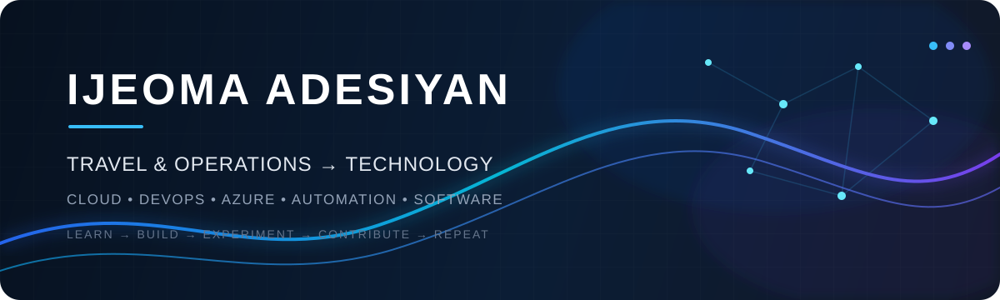

  

<h2 align="center">From Operations to Technology</h2>

  <strong>Cloud & DevOps • Azure • Automation • Software Development • Open Source</strong>

---

## 👋🏾 A Little About Me

I'm a **Travel & Operations professional making a deliberate transition into technology**, bringing with me a strong foundation in problem-solving, workflow management, customer experience, and coordinating complex processes.

Today, I'm channeling that experience into **Cloud, DevOps, automation, software development, and modern engineering workflows**.

I learn by building — taking what I study, applying it to real projects, breaking things, fixing them, and continuously improving.

My goal is simple:

> **Use technology to turn complex problems into practical, scalable solutions.**

---

## 🚀 What I'm Building

### 🛒 LoopCart

A hands-on engineering workflow project built around real software development practices.

**Focus areas:**
- Git & GitHub
- Feature branches
- Pull requests
- Code review
- Testing
- CI/CD
- Deployment workflows

🔗 [View LoopCart](https://github.com/IjeomaAdesiyan-star/loopcart)

---

### 📌 PinPoint Pro

An open-source contribution to a context-aware digital workspace and productivity environment.

My contribution journey has given me practical experience working with an existing open-source codebase, branches, pull requests, contributors, and GitHub Actions.

🔗 [View PinPoint Pro](https://github.com/IjeomaAdesiyan-star/pinpointpro)

---

## ☁️ Technology & Tools

  

### Current Focus

- ☁️ Cloud Computing & Microsoft Azure
- ⚙️ DevOps & CI/CD
- 🔄 Git & GitHub workflows
- 🐳 Docker & containerisation
- 🐧 Linux
- 🏗️ Infrastructure as Code with Terraform
- 🐍 Python
- 🤖 AI-assisted development
- 🌐 Open-source contribution

---

## 🏆 Microsoft Applied Skills

| Credential | Verification |
|---|---|
| **Accelerate AI-assisted development by using GitHub Copilot** | [View Credential](https://learn.microsoft.com/api/credentials/share/en-gb/IjeomaAdesiyan-0927/8CDB69966B8756FF?sharingId=9412CF278B3D8809) |
| **Get started with Azure management tasks** | [View Credential](https://learn.microsoft.com/api/credentials/share/en-us/IjeomaAdesiyan-8330/932CEE171BF34EEC?sharingId=4D0EF2A9531D904B) |
| **Secure storage for Azure Files and Azure Blob Storage** | [View Credential](https://learn.microsoft.com/api/credentials/share/en-us/IjeomaAdesiyan-8330/9A571C4691E468CF?sharingId=4D0EF2A9531D904B) |

---

## 💡 What I Bring

My technology journey is strengthened by the experience I already have outside of technology.

- 🧩 **Problem-solving** — approaching challenges from both operational and technical perspectives
- 🔄 **Workflow thinking** — understanding how processes connect from start to finish
- 🤝 **Stakeholder & customer experience** — communicating clearly and working with people
- 📋 **Operations experience** — coordinating moving parts and managing complex processes
- ☁️ **Cloud & DevOps skills** — building practical technical capability through hands-on work
- 🛠️ **Learning by doing** — turning lessons into projects rather than stopping at theory

---

## 🔭 What's Next?

I'm continuing to build deeper capability in:

**Cloud → DevOps → Automation → Infrastructure → Software → AI**

The goal isn't simply to collect technologies.

It's to understand **how they work together to solve real problems.**

---

## ✍🏾 My Approach

**Learn → Build → Experiment → Contribute → Repeat.**

---

## 🌐 Connect With Me

  
  
  

---

## 📊 GitHub

  

---

  <strong>Building the bridge between operations and technology.</strong>

  ☁️ ⚙️ 💻 🚀

